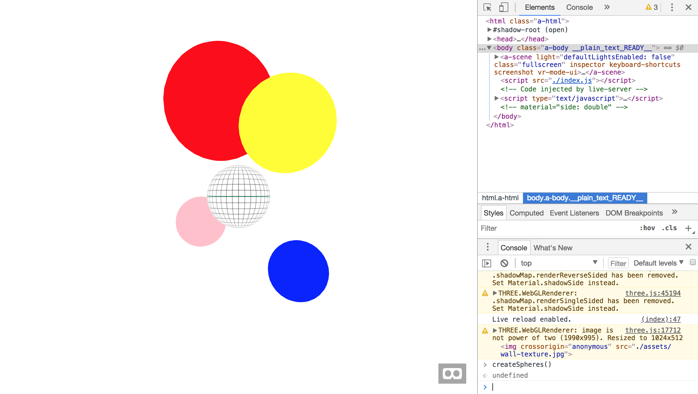

## Objectives

1. Explore the first two elements of the ECS paradigm: Entities and Components

## Overview

We are going to build a simple world step by step, adding complexity as we go. While we provide code examples, you should feel free (and are encouraged to) experiment as we go. Consider using different primitives (i.e. an `<a-octahedron>` instead of an `<a-sphere>`) and/or components as we progress. After all, this is your world!

We will be building off of the provided `index.html` file, and start writing our own functionality in with `index.js`. You will see that both the `a-frame` library, as well as our `index.js` script, have already been included in the `html`.

## Making Entities, Adding Components...

Let's add a sphere to our scene. Go ahead and create an `<a-sphere>` providing it a starting position of `position="0 0 0"`, and a radius of "2". Give it a color attribute as either a string, hex value, or rgb value (i.e. `#33F`, or `blue`).

Let's also uncomment out the `camera` entity we have already provided. By default, A-Frame provides us with a camera. By using the one we provided in `index.html`, we can explicitly control the perspective we have (as a user) in our scene. You will notice that the position of the starting position of the camera is 15 units in the third coordinate of the `position` attribute, aka the "z-axis". This allows us to back the perspective up so that we can see the entity we rendered at starting position "0 0 0" smack-dab in the middle of our scene!

Go ahead and start your server if you haven't already and check out what we have rendering in the browser. If everything is in place, you will most likely see a black shape in the middle of your scene. If you are wondering why it doesn't have the color you provided it, this is because we have set the parent `a-scene` tag to have no lighting! Uncomment the `<a-entity>` line with the `light` attribute to ensure we have nice even illumination everywhere.

Alright -- now that we have some basics squared away, let's incorporate JavaScript to see how we can automatically spawn several of these `<a-sphere>` entities. The next bit we will write in `index.js`.

## Incorporating JavaScript

You will see that we have provided several starter functions in `index.js` to get you on your way. Please implement the `createSpheres` function. It should, as long as we have more random values in our two arrays, create and add `<a-spheres>` to the scene using the `addEntityToScene` and the `createSphere` functions. If everything is working properly, yours should look something like the image below (colors/positions will be random of course!). You will see that we invoked `createSpheres()` directly in the Chrome console:



## Jazzing It Up

##### Center Sphere

Let's add an [animation][animations-doc] to our spheres to make our scene really pop. For our center sphere, let's have it rotate around the y-axis. For our other spheres a slight bob, so that they move enough to make a relaxing floating sphere scene, should do the trick.

Take a moment to peak at the [documentation][animations-doc]. You will see that, to provide an animation to an `<a-entity>`, we need to provide an `<a-animation>` within the entity's tags. Add a fixed rotation to our central `<a-sphere>` in `index.html`. (If you haven't already, make sure you give the `<a-sphere>` a texture instead of a color: `<a-sphere src="./assets/wall-texture.jpg"...>`. We used the following attributes to ensure a steady rotation around the y-axis:

```
attribute="rotation"
dur="10000"
fill="none"
from="0 0 0"
to="0 360 0"
easing="linear"
repeat="indefinite"
```

##### Randomly Generated Spheres

For our randomly generated spheres, we are going to have to add our animation entities in our JavaScript. Go ahead and create a new function named `addBobAnimationToElement`. This function should do the following:
  - accepts, in first position, a DOM element (in our example, it would be an `<a-sphere>`)
  - create an `<a-animation>` element that does the following:
    - acts on the `position` attribute of its parent
    - repeats indefinitely
    - starts at -1 and ends at 1 on the y-axis **(relative to its already set position!)**
    - uses an easing and direction option to provide a bob effect
    - completes a full animation in 2 seconds or less
  - using `appendChild`, it adds that new animation as a child element of the passed argument
  - returns the originally passed DOM element with the animation added

Don't forget to update your `index.js` code so that the `<a-sphere>`s have their animation added before they are appended to the DOM!

If possible, work in small groups or pairs! If you are having trouble, take a look at the `createSphere` function and the [documentation][animations-docs] for guidance. If you are stumped by implementing an animation that transforms the _relative_ position of the entity instead of the _absolute_ position, take a look at [this page][position-doc]. There are several ways you can implement this -- see what works for you!

**BONUS:** provide a random animation start delay (within reason) to ensure the animations are not all in sync. (Reference the docs!). Below is a GIF of the solution we came up with:


In the next lab, we are going to explore "System" in the ECS paradigm and see how we can tie it all together into an interactive experience. We will use a lot of the same code from this repository.

[animations-doc]: "https://github.com/aframevr/aframe/blob/master/docs/core/animations.md"
[position-doc]: "https://github.com/aframevr/aframe/blob/master/docs/components/position.md"
